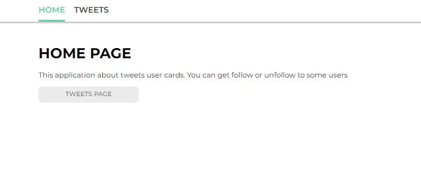
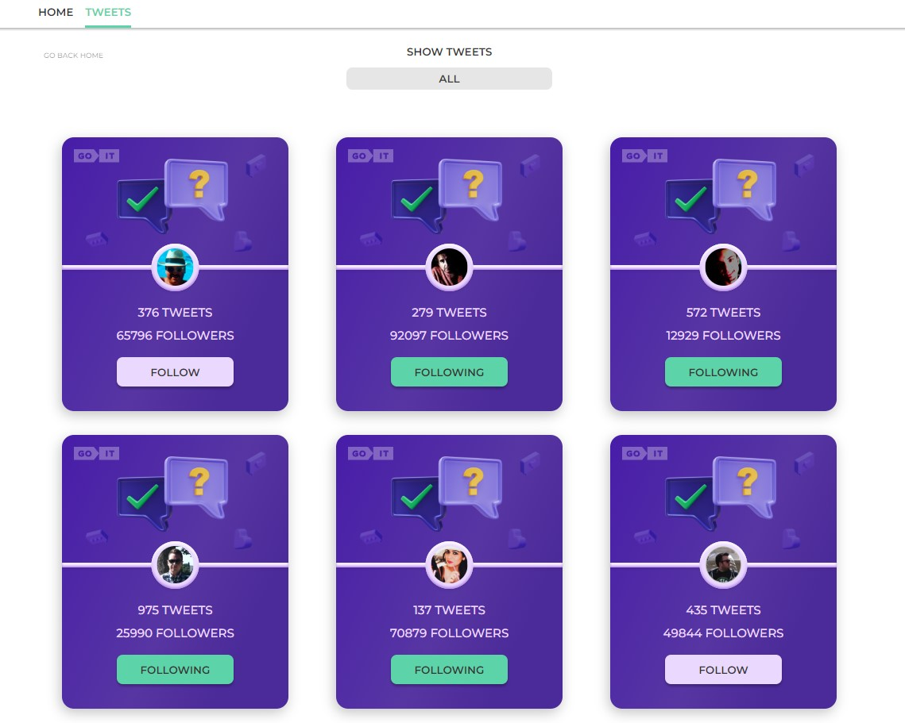
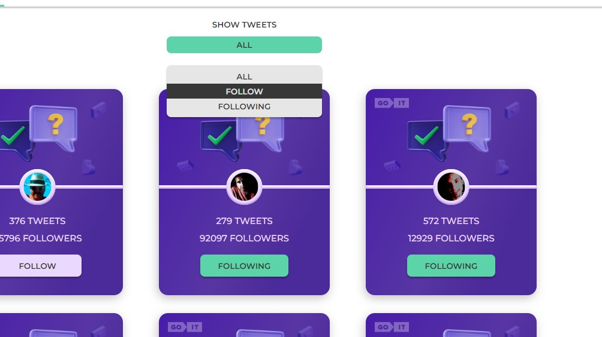
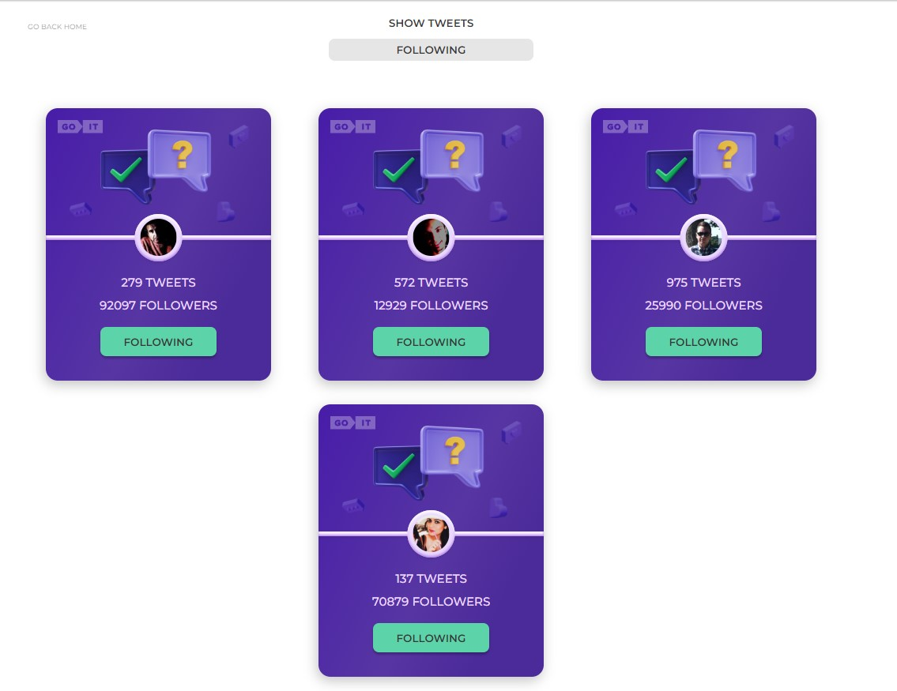

# Tweets user cards -> REACT

## Home page



## Tweets page



Filter for tweets state





## Technical Stack

- React
- React-router
- Axios
- styled-components

### Preparing for coding

1. Make sure you have an LTS version of Node.js installed on your computer.
   [Download and install](https://nodejs.org/en/) if needed.
2. Install the project's base dependencies with the `npm install` command.
3. Start development mode by running the `npm start` command.
4. Go to [http://localhost:3000](http://localhost:3000) in your browser. This
   page will automatically reload after saving changes to the project files.

### Deploy

The production version of the project will automatically be linted, built, and
deployed to GitHub Pages, in the `gh-pages` branch, every time the `main` branch
is updated. For example, after a direct push or an accepted pull request. To do
this, you need to edit the `homepage` field in the `package.json` file,
replacing `your_username` and `your_repo_name` with your own, and submit the
changes to GitHub.

```json
"homepage": "https://your_username.github.io/your_repo_name/"
```

Next, you need to go to the settings of the GitHub repository (`Settings` >
`Pages`) and set the distribution of the production version of files from the
`/root` folder of the `gh-pages` branch, if this was not done automatically.
